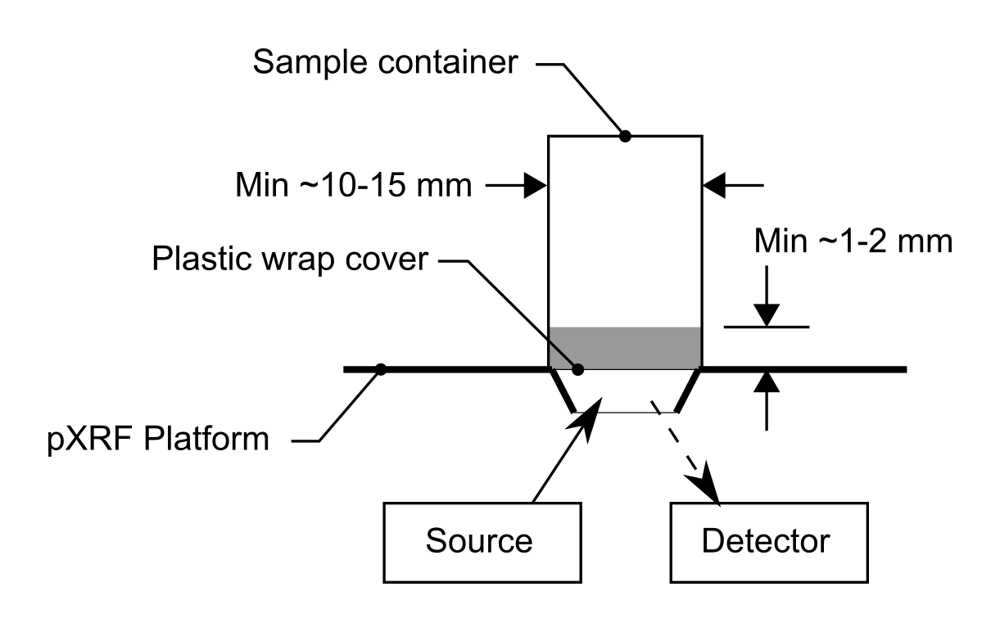

# Feature Demonstration {#chapter-feature-demo}

This chapter demonstrates some of the things you're going to want to do in your thesis. It also has the added benefit of adding filler text to see how the three output formats (and the default template parameters) handle the features of bookdown that are needed for most theses. This chapter assumes that you have some basic familiarity with [RMarkdown](https://bookdown.org/yihui/rmarkdown/) and [bookdown](https://bookdown.org/yihui/bookdown/).

I think that the ["knit then merge"](https://bookdown.org/yihui/bookdown/new-session.html) strategy works best for theses, which is why I've used it by default here (this is why `new_session: yes` is in _bookdown.yml). This means that each chapter is a self-contained, and when you hit "knit" you should get an HTML preview (if some of your chapters get out of sync, you might have to build the whole book before you preview. You can use the "Build" tab in RStudio to render the whole book in any of the three formats supported by default). You should load your packages, load your data, and set default chunk options (you probably want `echo = FALSE` and `fig.align = "center"`) in the first chunk. I set my default ggplot2 theme here as well. Even better, use a file that you `source()` in all of your chapters so that your themes and chunk options are all stored in one place (this is what I've done in this example...see `thesis-utils.R`).

```{r, include=FALSE}
source("thesis-utils.R")
```

## Output formats

This template renders solidly OK Word (for your supervisor) and HTML output (for you to preview), but is intended to produce flawless PDF (or at least provide you all the tools you need to make it flawless). There will come a point where you won't be able to get Word or HTML to look right because of custom LaTeX needed for your tables, but because the HTML preview is so fast compared to PDF, I found it useful to keep it producing plausible output (plausible enough to spot errors) for as long as possible. This is the [general advice in the bookdown book](https://bookdown.org/yihui/bookdown/) as well.

## Referencing

References use the `@reference_id` format, where, `reference_id` is in the file `book.bib` as a BibLaTeX or BibTeX entry. This template uses BibLaTeX instead of natbib because BibLaTeX supports Unicode, which makes it a bit easier to format the bib entries. I use [Zotero](https://www.zotero.org/) and the [Better BibTeX for Zotero](https://retorque.re/zotero-better-bibtex/) plugin. You can use the [rbbt package](https://github.com/paleolimbot/rbbt) to insert BibLaTeX (or BibTeX, if you must) into your current RStudio cursor using the Addins menu. I use a "Citation key format" (see the Zotero preferences once you have Better BibTeX installed) that looks like this:

```
[auth.etal:lower:replace=.,_][>0][shortyear]|[veryshorttitle][shortyear]
```

...so that my citations look like `@dunnington_etal19`, `@dunnington_spooner18`, and `@dunnington11` by default (occasionally I modify the .bib file for commonly used references with long or impronouncable names). This makes it easier to spot errors in the markdown (personally), and to modify copy-and-pasted text that contains the usual author-date format. The references above are included in the template book.bib, see how they look in reference form at the end of this sentence [@dunnington_etal19; @dunnington_spooner18; @dunnington11]. Don't forget that you can include them as nouns in a sentence (without the brackets) as well: @dunnington_etal19 is the last paper I published, @dunnington_spooner18 is a paper I published a few years ago, and @dunnington11 is my honours thesis.

I'm still working on how to get the citations and bibliography I want using BibLaTeX, but I've read enough to know that it's all at least *possible* (which is why I keep using BibLaTeX instead of natbib).

## Cross-references

You can link to a Chapter using reference syntax: Chapter \@ref(chapter-feature-demo). Figures always have a `fig:` prefix (followed by the chunk label), and tables always have a `tab:` prefix (followed by the chunk label). Using cross-references means that you can move your figures around without fear of incorrect numbering! You might need to the move them around in the text to get the correct placement, however (after the paragraph containing the first reference should do it).

## Figures

### Static (previously prepared) figures

You can insert static figures using `knitr::include_graphics("path/to/filename.png")`. If you have a PDF version, make sure it's called `"path/to/filename.pdf"` (identical filename but with .pdf extension), and the PDF version will be used in the LaTeX output (with nice crisp edges at all resolutions!). The downside of using PDF versions of figures in LaTeX is that they need to be sized appropriately (they will spill off the edge of the page and not be resized if they are too big). You can usually export a PDF that is the correct size in whatever software you're using (the "correct size" here is the page size minus the margins with room for the figure caption...for most thesis formats you're looking at 6 in width by 8 in height, or 150 mm width by 200 mm height). Figure \@ref(fig:static-example) is an example of a figure that was prepared in this way. Any `fig.height` or `fig.width` you put in the chunk options will be ignored (I think).

```{r static-example, fig.cap="A schematic of X-Ray Fluorescence measurement of small aquatic sediment samples."}

```

If you're generating your figures using R, the figure will always be resized such that it doesn't spill off the edge of the page (even if your `fig.height` and `fig.wdith`, which are always in inches, are greater than the available size). For example, Figure \@ref(fig:ggplot-example) was prepared using the ggplot2 package. It's best to be explicit (and realistic) about size using `fig.height` and `fig.wdith`, which means that the base font size in the ggplot2 `theme_*()` functions is *actually* the font size in the figure (and the `size` aesthetic actually represents size in millimeters).

```{r ggplot-example, fig.width = 6, fig.height = 3, fig.cap="City milage (cty) and highway milage (hwy) of vehicle models in the ggplot2's mpg dataset by vechicle class."}
ggplot(mpg, aes(cty, hwy, col = class)) +
  geom_point()
```

### Short captions

You will probably need to use the `fig.scap` ("short caption") feature if your thesis format requires a list of figures. The `fig.scap` shows up in the figure list but not below the actual figure (Figure \@ref(fig:ggplot-example-long-cap)).

```{r ggplot-example-long-cap, fig.width = 6, fig.height = 3, fig.scap="City milage and highway milage of vehicle models in the ggplot2's mpg dataset.", fig.cap="City milage (cty) and highway milage (hwy) of vehicle models in the ggplot2's mpg dataset by vechicle class."}
ggplot(mpg, aes(cty, hwy, col = class)) +
  geom_point()
```

### Rotated figures

If you can avoid it, don't use rotated figures. If you absolutely need to rotate a figure, make sure that you are following your University's thesis guidelines for rotated figures (most importantly, do you have to rotate the caption?). The TL;DR is that it's easy to rotate the figure, but hard to rotate the caption. You can rotate a figure using `out.extra="angle=90"` as a chunk option, which will rotate the figure in the PDF output but not the HTML or Word outputs (probably what you want; Figure \@ref(fig:ggplot-example-rotated)). Both types of figure rotation preserve the location of the page number in the PDF output.

```{r ggplot-example-rotated, out.extra="angle=90", fig.width = 6, fig.height = 3, fig.cap="City milage (cty) and highway milage (hwy) of vehicle models in the ggplot2's mpg dataset by vechicle class, rotated without the caption floating amongst the text like all the other figures."}
ggplot(mpg, aes(cty, hwy, col = class)) +
  geom_point()
```

If you absolutely need to rotate the caption, use the LaTeX command `\begin{landscape}` before the figure and `\end{landscape}` after the figure. This will rotate the figure and the caption, but will also put the figure on its own page. This is best suited to an Appendix (e.g., Appendix \@ref(appendix-example)), where it's unlikely that a figure on its own page will get out of sync with the text (Figure \@ref(fig:ggplot-example-rotated-page)). The latex commands will show up in the word document output but not the HTML output.

\begin{landscape}

```{r ggplot-example-rotated-page, fig.width = 6, fig.height = 3, fig.cap="City milage (cty) and highway milage (hwy) of vehicle models in the ggplot2's mpg dataset by vechicle class, rotated with the caption and on its own page."}
ggplot(mpg, aes(cty, hwy, col = class)) +
  geom_point()
```

\end{landscape}

### Formatting in figure captions

Markdown in captions won't work in PDF output (the document may fail to compile and the captions certainly won't look right), but you can use raw LaTeX if you want formatting. I use a function `md_caption()` that converts its input to LaTeX if `knitr::is_latex_output()` is TRUE. It doesn't work with references or escaped special characters (i.e., if you need an actual `*` or `~` or `^` in your output), but it works for basic formatting (super/subscript, bold, italic, the percent sign) and you can usually avoid the rest (Figure \@ref(fig:ggplot-example-caption-format)).

```{r ggplot-example-caption-format, fig.width = 6, fig.height = 3, fig.cap=md_caption("City milage (*cty*) and highway milage (*hwy*) of vehicle models in the ggplot2's mpg dataset by vechicle class.")}
ggplot(mpg, aes(cty, hwy, col = class)) +
  geom_point()
```

## Tables

Getting your tables to look right is probably the hardest part of the whole thesis. I suggest avoiding them (make a nice figure instead!), but it's unlikely your supervisor will agree with me. Thus, in the `thesis-utils.R` file (that I `source()` in all the chapters of the thesis that use R code), I provide the `thesis_kable()` and `thesis_kable_raw_markdown()` functions, which wrap some [kableExtra](http://haozhu233.github.io/kableExtra/) functionality (eventually the [gt package](https://gt.rstudio.com/) will produce LaTeX output, but that day is not this day). I use the `thesis_kable()` function (which you can and should modify to fit your needs) to establish a common table style (Table \@ref(tab:example-table-basic)).

```{r example-table-basic}
mpg %>% 
  group_by(class) %>% 
  summarise(
    `Mean Highway Mileage (mpg)` = mean(hwy),
    `Mean City Mileage (mpg)` = mean(cty),
    n = n()
  ) %>% 
  thesis_kable(
    caption = "Mean city and highway mileage of vehicles in ggplot2's mpg dataset.",
    digits = c(NA, 1, 1, 0)
  )
```

### Tables with formatting in cells

In HTML and Word outputs, you can use markdown formatting in cells no problem. In LaTeX, this won't work. To keep your table generation consistent, I've put together the `thesis_kable_raw_markdown()` function, which (like `md_caption()`) detects LaTeX output and converts the values of your table from markdown to LaTeX. This has some serious limitations, but should work for most bold/italic/superscript/subscript you come up with. In Table \@ref(tab:example-table-italic-n), I use this function to format for the *n* column (and header). Note that I've used `md_caption()` to italicize *n* in the caption as well.

```{r example-table-italic-n}
mpg %>% 
  group_by(class) %>% 
  summarise(
    `Mean Highway Mileage (mpg)` = mean(hwy),
    `Mean City Mileage (mpg)` = mean(cty),
    `*n*` = paste0("*", n(), "*")
  ) %>% 
  thesis_kable_raw_markdown(
    caption = md_caption(
      "Mean city and highway mileage of vehicles in ggplot2's mpg dataset with an italicized *n* column."
    ),
    digits = c(NA, 1, 1, 0)
  )
```

### Tables that are too wide

Your first line of defense against tables that are too wide is specifying the width of the columns explicitly. You can do this using `kableExtra::column_spec()`. Keep in mind that you probably have a maximum of 6 inches to work with, and you'll have to fiddle with the widths a lot. Wide tables are usually OK in HTML, where the automatic text wrapping is much better. In Word, you will have to manually modify each table if you care deeply about how it looks.

```{r example-table-fixed-col-width}
mpg %>% 
  group_by(manufacturer) %>% 
  summarise(
    `Models` = paste(unique(model), collapse = ", "),
    `Model Years` = paste(unique(sort(year)), collapse = ", ")
  ) %>% 
  thesis_kable(
    caption = "A particularly wide table used to demonstrate manually specified column width."
  ) %>% 
  column_spec(1, "0.8in") %>% 
  column_spec(2, "3in") %>% 
  column_spec(3, "0.8in")
```

Just like a rotated figure (with a rotated caption), you can use `\begin{landscape` and `\end{landscape}` to rotate a table (and its caption). You should only do this in an Appendix, since it will throw off the flow of the text. Table \@ref(tab:example-table-landscape) demonstrates this approach. These won't be rotated in the Word output.

\begin{landscape}

```{r example-table-landscape}
mpg %>% 
  group_by(class) %>% 
  summarise_if(is.numeric, mean) %>% 
  mutate_all(as.character) %>% 
  thesis_kable(
    caption = "A particularly wide table used to demonstrate rotated tables using the landscape environment."
  )
```

\end{landscape}

### Tables that are too long

If your table has too many rows to fit on one page, you can pass `longtable = TRUE` to `thesis_kable()`. This throws off the flow of text, but can deal with repeated headers/captions rules by which your University thesis guidelines likely require you to abide (this even works in landscape tables!!!). Use `style = list(latex_options = "repeat_header")` to repeat the header on all the pages if you need it. Table \@ref(tab:example-table-too-long) demonstrates this usage. Like rotated figures and tables, these tables are best suited to an Appendix.

```{r example-table-too-long}
mpg %>% 
  head(50) %>% 
  select(manufacturer, model, year, cty, hwy) %>% 
  thesis_kable(
    caption = "A particularly long table used to demonstrate repeated table header/caption.",
    longtable = TRUE,
    style = list(latex_options = "repeat_header")
  )
```
